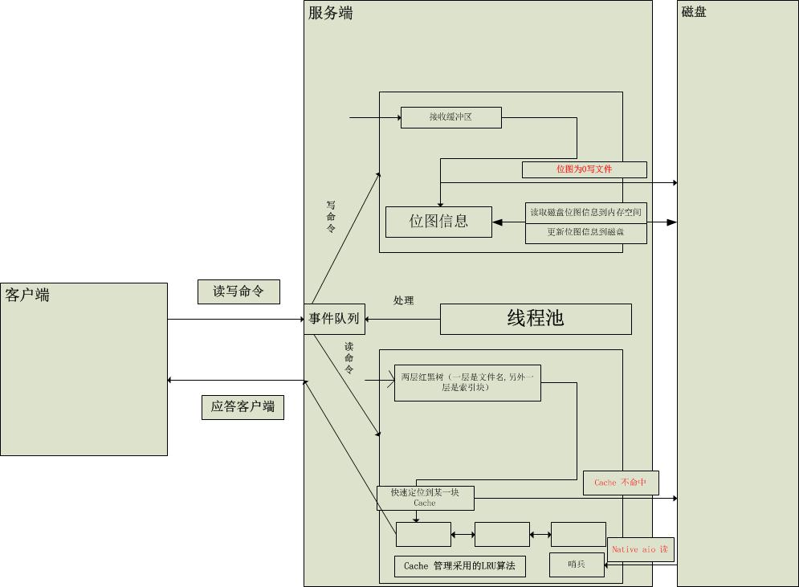
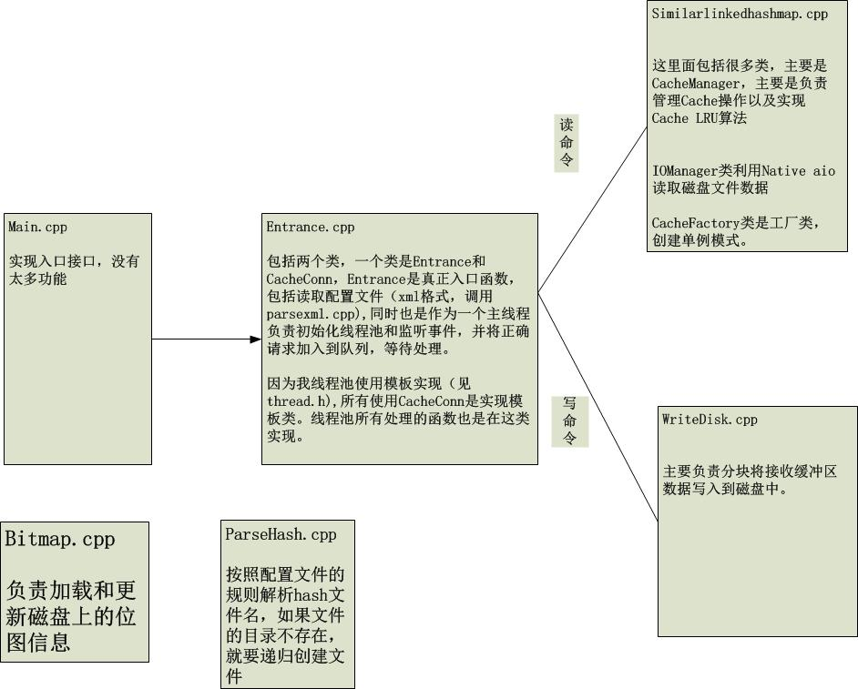

> 拒绝闭门造车，从我做起，不得不说互联网行业相对其他行业之所以发展的如此之快，我们第一要感谢开源的精神。每个人都是从小白慢慢 成长，没有什么绝对的天才。我这个代码也参考了许多人的代码思想，包括（`nginx，libevent`等之类的），虽然无法与之比拟，但是我坚信自己坚持不懈的动机总会有一天给我带来不一样感觉，之前发布的一些代码，文档并没有好好编写，从这份源码开始我要认真对待自己每一次的代码编写。`Enjoy Coding`

----------

> 缓冲池是为了减少CPU与磁盘之间的鸿沟，很多基于磁盘的数据库系统通常使用缓冲池技术来提高整体的性能。

我设计这个缓冲池的目的
=====
> 通过缓存池的作用，减少服务器对IO的访问，降低磁盘的压力，可以采用Linux下命令,`dstat`进行查看。

**操作系统已经有了page cache，那么为什么我们要自己实现缓冲池呢？**
> 是我的实现的效果比内核系统要好吗？当然不是，这里我们之所以要自己实现缓存池，是因为page cache管理的缓存粒度太大,一般是按照页大小管理，4kb。详细[Buffer cache和page cache的区别](http://leanote.com/blog/post/57b2cd23ab644135ea04ff3c)。


设计思路
=====
> 下图是实现这个功能的设计图。



代码实现设计
======
> 下面是代码的简介


程序最新版修改说明
===
为了兼容`centos 5`和`centos 7`系统，不采用内核自带的`native aio`,而是使用`libaio`的库。所以下面程序使用说明不能马上使用，而是先安装`libaio`库，然后根据自己安装路径修改`makefile`的内容。然后再实现下面的命令，关于安装`libaio`库可以参考[异步IO之native aio篇](http://youbingchenyoubing.leanote.com/post/%E5%BC%82%E6%AD%A5IO%E4%B9%8Bnative-aio%E7%AF%87)

程序使用说明：
====
```shell
cd  ./src/
make
make  install
cd ../bin
./cacheManager -c ../conf/config.xml
```
新版本
====
> 缓冲池 新版本，除了前面画出的代码功能图（详细见[内存缓存池](https://github.com/youbingchenyoubing/cachePool/blob/master/README.md)），目前还增加了创建固定文件的功能，后期还会增加其他的功能了。这个版本主要是修复测试中一些bug。
----------


Author：chenyoubing
Email: chenyoubing@stu.xmu.edu.cn


